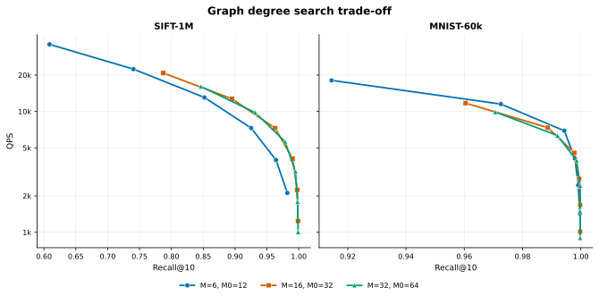
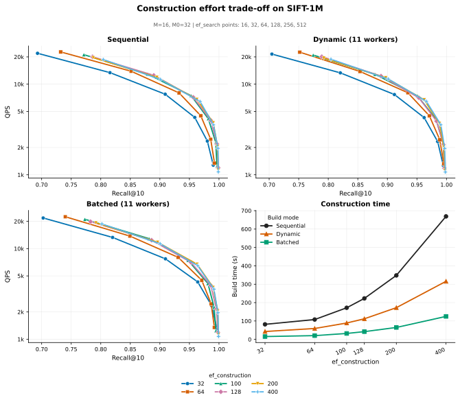
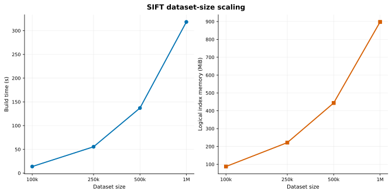
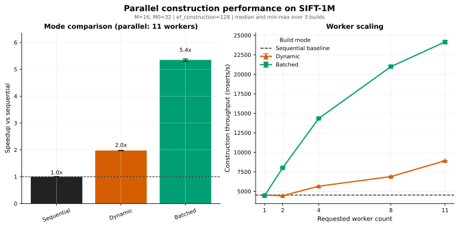
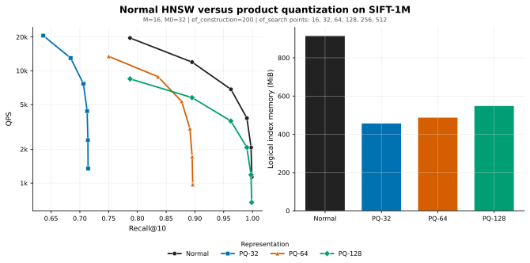

# hnsw

**Hierarchical Navigable Small World** (HNSW) is an approximate nearest-neighbor index.
Instead of comparing a query vector with every vector in the dataset, it builds a layered graph and uses that graph to quickly explore close candidates.

The tradeoff is the usual one for approximate search: searches are much faster than brute force, but recall depends on the parameters used to build and query the index.

## What this includes

- [x] insertion into the graph
- [x] search for the `k` closest vectors
- [x] save/load support
- [x] the usual `M`, `M0`, `ef_construction`, and `ef_search` parameters
- [x] seeded construction for reproducible indexes
- [x] a small benchmark runner for HDF5 ANN datasets
- [x] reusable search/insert contexts to avoid allocating on every operation
- [x] squared L2 distance
- [x] product quantization
- [x] custom distance metrics
- [x] parallel construction

### Non goals

- [ ] deletion
- [ ] filtering
- [ ] metadata storage

The goal is the HNSW data structure itself, not a full vector database.
Also, this is not intended to replace production ANN libraries.

## Usage

```rust
use hnsw::{Hnsw, HnswSearcher, L2Squared};

let mut index = Hnsw::<2>::new(
    16,  // M: max links on upper layers
    32,  // M0: max links on layer 0
    128, // ef_construction: candidate list size during insertion
    L2Squared,
);

index.insert([0.0, 0.0]);
index.insert([3.0, 3.0]);
index.insert([4.0, 4.0]);

let results = index.search_with_ef(&[1.0, 1.0], 2, 32);

for (id, dist) in results {
    println!("id: {id}, dist²: {dist:.3}");
}
```

For a quick default setup:

```rust
let mut index = Hnsw::<128>::new_default(16);
```

`new_default(M)` uses:

- `M0 = 2 * M`
- `ef_construction = 128`
- default query search effort is `ef_search = 32`

Search effort is query configuration, not index state. The default `search(query, k)` uses `ef_search = 32`; use `search_with_ef` when a query needs a different effort.

## Benchmarks

Recall-QPS curves sweep `ef_search`: increasing it usually raises recall and lowers QPS. Points toward the upper right are better.

### Graph degree



### Construction effort



### Dataset-size scaling



### Parallel construction

Construction can be run sequentially, dynamically with concurrent inserts, or in a batched mode optimized for building an empty index.



### Product quantization



### Detailed benchmark results

Detailed results, configurations, and reproduction instructions are available in [`benchmarks/README.md`](benchmarks/README.md).

### Reproducing the benchmark

Run the complete benchmark suite, including index construction, measurement, and plotting:

```bash
./benchmarks/run.sh all
```

The suite uses the configs in `benchmarks/configs/`, writes results to `benchmarks/results/`, and generates the figures in `benchmarks/plots/`.

## How it works

Each inserted vector becomes a node in a graph.
Most nodes live only on layer 0, while a few are randomly promoted to higher layers.
The higher layers are sparse and act like long-range shortcuts.

Search starts at the current entry point on the top layer, greedily moves closer to the query, and then repeats this while descending layer by layer.
On layer 0, the search becomes wider. It keeps a frontier of candidates to visit and a bounded set of the best candidates found so far.
Once the closest item in the frontier is already worse than the worst item in the result set, the search can stop.

Insertion uses the same idea. It searches the existing graph to find candidate neighbors for the new node, prunes that candidate set, links the new node, and adds backlinks from the selected neighbors.
If an existing node gets too many links, its neighbor list is pruned again.

Two parallel construction modes are available.
Dynamic construction inserts vectors into the graph concurrently and can also extend a non-empty index.
Batched construction preallocates the nodes for an empty graph before linking them in parallel, which avoids some per-insert synchronization and is the faster build path when all vectors are available up front.
Both parallel construction methods take an optional worker count; `None` uses available parallelism.

## Some implementation choices

### Const generic dimensions

Vectors are stored as `[f32; D]` instead of `Vec<f32>`.
That makes dimensions a compile-time part of the index type.

Every vector in one index has the same size, so representing that in the type avoids checking the dimension on every insert/search.
It also keeps vector storage flat and makes the distance function work on fixed-size arrays instead of slices whose length has to be trusted at runtime.

### Custom distance metrics

`Hnsw<D, DS = L2Squared>` is generic over a `Distance<D>` trait.
The distance metric is part of the index type, so Rust specializes the index code for each metric at compile time.

That means distance calls are statically dispatched: there is no `dyn Distance`, no virtual call, and no runtime metric lookup inside the search loop.

By default, the index uses squared L2 distance, but any metric that implements `Distance<D>` can be used:

```rust
use hnsw::{Distance, Hnsw, L2Squared};

// default L2Squared
let mut index = Hnsw::<128>::new(16, 32, 128, L2Squared);

// custom metric
struct Cosine;
impl<const D: usize> Distance<D> for Cosine {
    fn distance(&self, a: &[f32; D], b: &[f32; D]) -> f32 {
        // your implementation here
        todo!()
    }
}
let mut index = Hnsw::<128, Cosine>::new(16, 32, 128, Cosine);
```

`new_seeded` also accepts custom distances.
`new_default` is available when the distance type implements `Default`.

### Reusable contexts

There are `insert_context` and `search_context` helpers.
They hold the heaps and scratch buffers used by insertion/search, so repeated calls do not need to keep allocating the same temporary structures.

The simple methods still exist:

```rust
index.insert(vector);
let results = index.search(&query, 10);
```

But benchmark code uses the context versions:

```rust
let mut search_ctx = index.search_context();
let results = index.search_with_context(&query, 10, 64, &mut search_ctx);
```

### Epoch markers instead of clearing visited arrays

Search and neighbor selection need to know which nodes have already been seen.
Instead of clearing a visited array for every search, each node stores a small epoch marker.

During a query, insertion search, or neighbor selection, only a small part of the graph is usually touched.
Clearing a full `visited` array every time would make each operation pay a cost proportional to the whole index size, even when the graph walk itself only visited a small number of nodes.

With epoch markers, each operation increments the current epoch and marks the nodes it touches with that value.
Checking whether a node was already seen is then just comparing its stored epoch with the current one.

### Save/load

Indexes can be saved to disk and loaded again:

```rust
index.save("index.bin")?;
let loaded = Hnsw::<128>::load("index.bin")?;
```

Saved indexes contain graph construction state and data, but not query-time search configuration. Choose `ef_search` for each query with `search_with_ef`.
The random seed is stored too.
When an index is loaded, the RNG is advanced by the number of already-inserted vectors so that continuing insertion behaves the same as it would have before saving.

## Tests

```sh
cargo test
```

The tests cover small exact examples, empty indexes, duplicate vectors, save/load roundtrips, max connection limits, duplicate neighbor checks, and a random recall check against brute force.

## References

This is based on the HNSW paper:

- Yu. A. Malkov and D. A. Yashunin, _Efficient and robust approximate nearest neighbor search using Hierarchical Navigable Small World graphs_, 2018.

I also looked at Redis' HNSW/vector set implementation while working through some of the practical details around graph construction and neighbor pruning.
